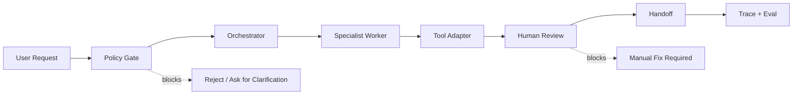

# OpenClaw / Klause Redacted Architecture

Status: public-facing architecture proof  
Datenstand: 2026-05-13  
Datenbasis: lokale/private Agenten- und Paperclip-Struktur, ohne Prompts, Logs, Memory oder Kundendaten

## Ziel

Der OpenClaw/Klause Case zeigt nicht "magische Agenten". Er zeigt, wie ein komplexes Agenten-Setup kontrollierbar gemacht wird:

- Rollen statt unklarer Autonomie
- Permissions statt freier Tool-Zugriff
- Human Review an riskanten Stellen
- synthetische Traces statt echte Logs
- Threat Model und Known Limits statt Hype

## Abstraktes Systembild

## Rollen

| Rolle | Aufgabe | Darf nicht |
| --- | --- | --- |
| Policy Gate | Scope, Risiko und erlaubte Aktion prüfen | externe Aktionen ohne Freigabe starten |
| Orchestrator | Aufgabe zerlegen, Worker auswählen, Ergebnis zusammenführen | Secrets oder Rohlogs ausgeben |
| Specialist Worker | enges Teilproblem bearbeiten | Tool-Grenzen umgehen |
| Tool Adapter | definierte Operation auf Systemen ausführen | Daten außerhalb seines Scopes lesen |
| Human Review | riskante Outputs prüfen und freigeben | Freigabe automatisiert vortäuschen |
| Trace/Eval | synthetisch oder redacted nachvollziehen | echte private Logs public machen |

## Public-facing Beleg

Öffentlich gezeigt werden:

- Architekturdiagramm
- Permission Matrix
- synthetischer Trace
- Threat Model
- Eval-/Smoke-Test-Tabelle
- Loom-Script

Nicht gezeigt werden:

- echte Prompts
- Memory
- echte Logs
- private Arbeitsdaten
- Kundendaten
- interne Strategien oder Playbooks
- Tool-Secrets oder Provider-Keys

## Warum das für Implementation und Automation relevant ist

Viele AI-Projekte scheitern nicht am Modell, sondern an Scope, Übergabe, Tool-Rechten, Nachvollziehbarkeit und Betrieb. Dieser Case zeigt, dass Robert Agenten nicht als Blackbox verkauft, sondern als kontrollierbares System denkt.
